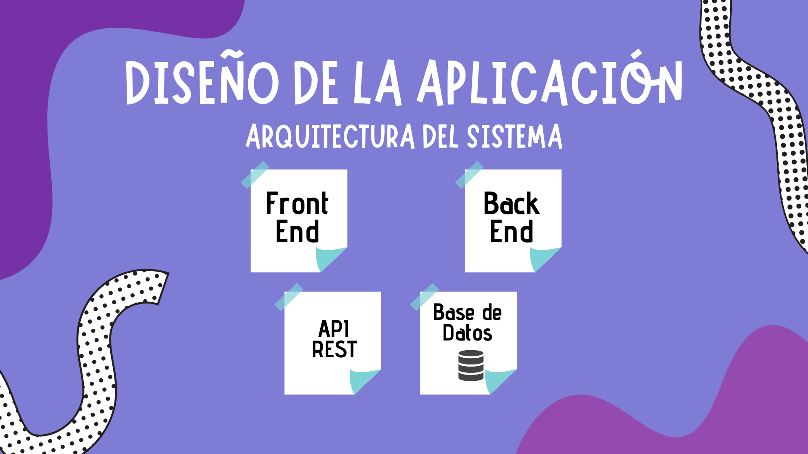
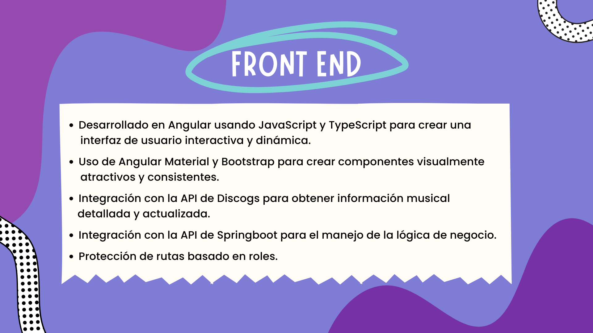
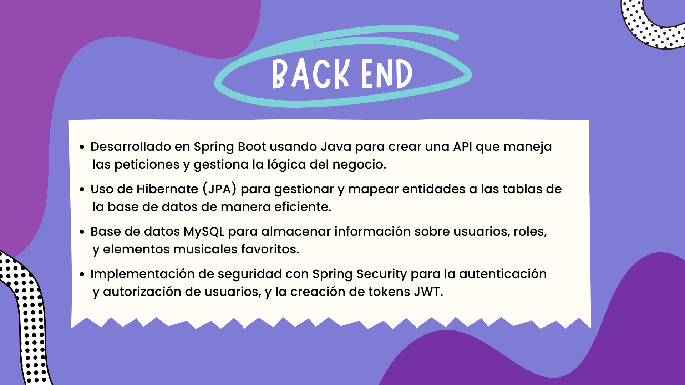
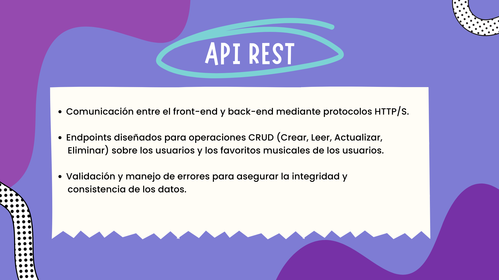
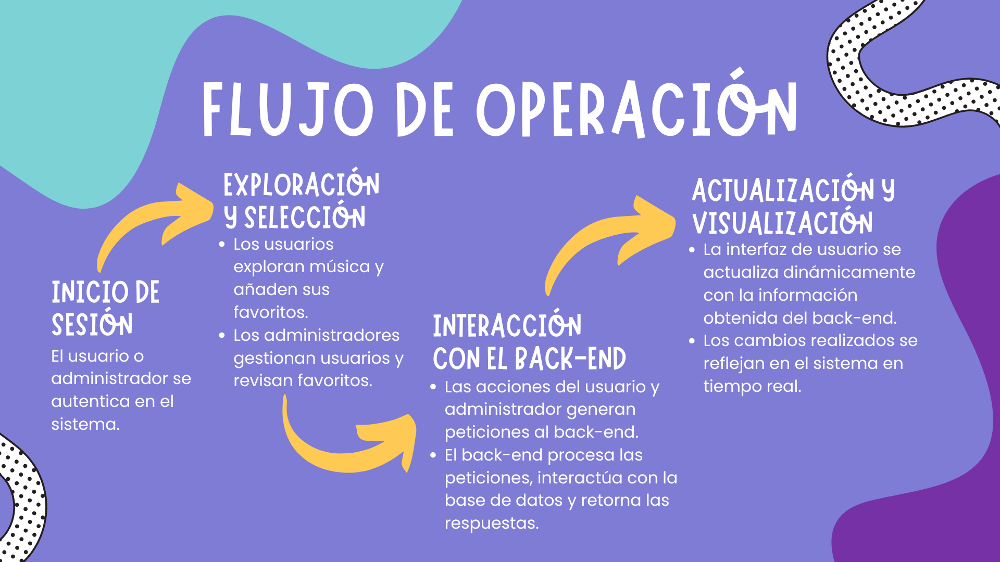
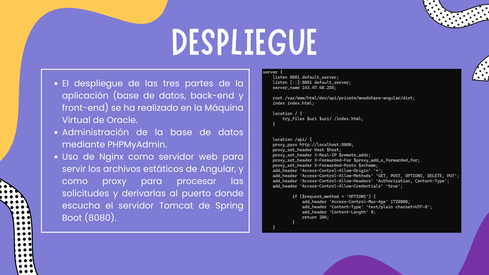
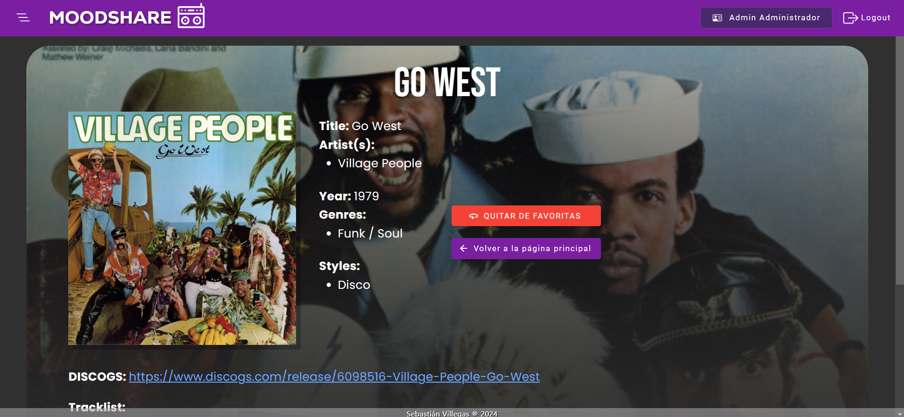
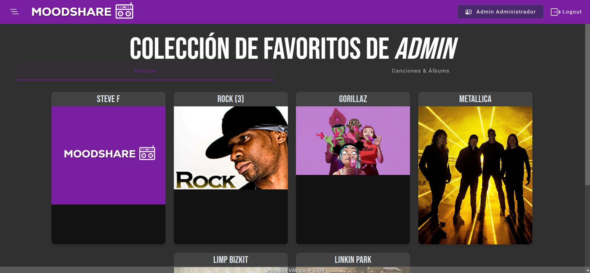

# MoodShare Backend

Este proyecto fue generado con [Spring Boot + Java](https://github.com/spring-projects/spring-boot).

MoodShare es una aplicación inspirada en mi amor por la música y el deseo de compartirlo con los demás, ha sido desarrollada con la idea de combinar esta visión con los conceptos aprendidos durante mi formación académica.

## Diseño de la aplicación

## Front-end

## Back-end

## API Rest

## Flujo de Operación

## Despliegue

## Capturas

