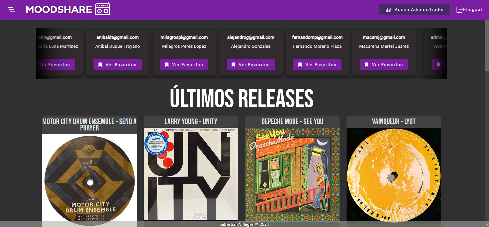

# MoodShare Back-end
> [!NOTE]
Este proyecto fue generado con [Spring Boot + Java](https://github.com/spring-projects/spring-boot).

MoodShare es una aplicación inspirada en mi amor por la música y el deseo de compartirlo con los demás, ha sido desarrollada con la idea de combinar esta visión con los conceptos aprendidos durante mi formación académica.

## Diseño de la aplicación

## Front-end

## Back-end

## API Rest

## Flujo de Operación

## Despliegue

## Capturas

## Instalación y Ejecución
>[!IMPORTANT]
> Asegúrate de tener instalados los siguientes programas en tu sistema:

- Java Development Kit (JDK) (versión 17 o superior): [Descargar JDK](https://www.oracle.com/java/technologies/downloads/?er=221886)
- Maven (opcional, pero recomendado): [Descargar Maven](https://maven.apache.org/)
- Git (opcional, para clonar el repositorio): [Descargar Git](https://git-scm.com/)
- Base de datos: Configura el servidor de la base de datos que utiliza el proyecto (MySQL).

### 1. Clonar el repositorio
>[!TIP]
> Clona este proyecto en tu máquina local utilizando Git:

git clone https://github.com/sebastianvillegas7/MoodShareBackEnd.git

### 2. Configurar la base de datos
> Asegúrate de que el servidor de la base de datos está corriendo.
> Crea una base de datos para la aplicación
> Configura las credenciales de acceso en el archivo application.properties

### 3. Construir y empaquetar el proyecto
> Ejecuta el siguiente comando para construir el proyecto:
mvn clean install

### 4. Ejecutar el proyecto
> Ejecuta la aplicación usando el siguiente comando:
java -jar target/moodshare-backend-0.0.1-SNAPSHOT.jar

>[!IMPORTANT]
> Por defecto, el servidor se ejecutará en http://localhost:8080.

### 5. API Endpoints
> Endpoints principales
POST /login
Autenticación de usuarios.

POST /registro
Registro de nuevos usuarios.

GET /users
Listado de usuarios registrados.

GET /users/{idUsuario}
Obtención de información de un usuario específico.

> Endpoints adicionales
GET /index
Endpoint principal de la aplicación.

GET /api/favs
Listado de favoritos de un usuario.

DELETE /api/favs/del
Eliminación de un favorito.
